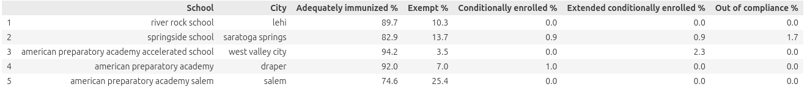
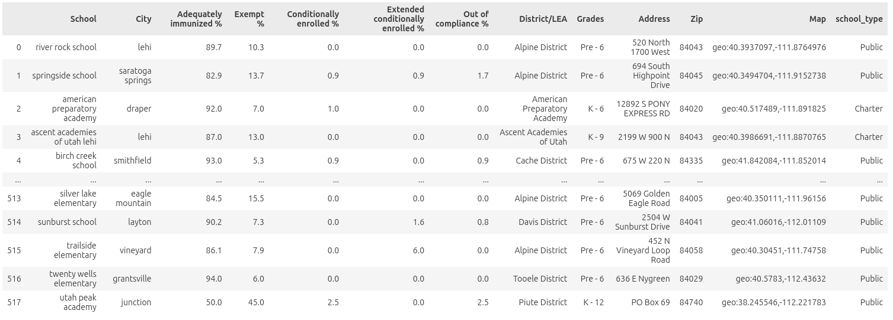
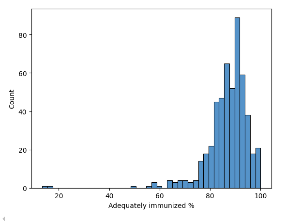
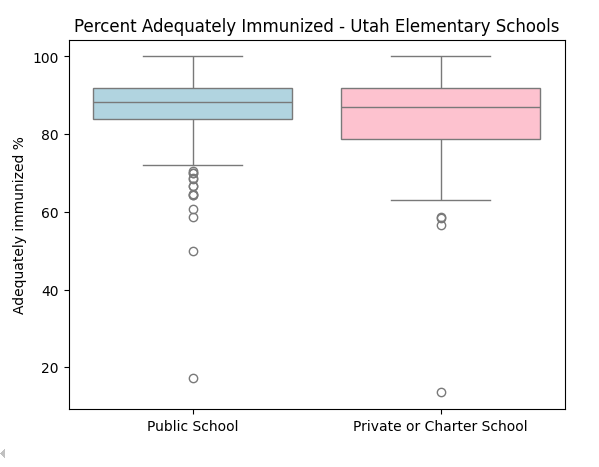
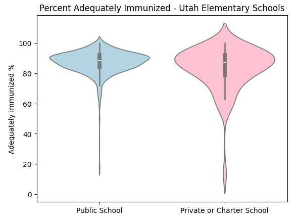

# Utah Kindergarten Immunization Data

## Introduction
Public health experts throughout the country are concerned about the rise in vaccine hesitancy. The threshold for herd immunity against measles (and other similarly infectious diseases) is fairly high at 95%, so after accounting for those who are medically unable to receive vaccinations (infants, immunocompromised, etc), the space for vaccine-averse people in an ideally immune society is really quite limited. 

Utah is an interesting case study, because despite being very conservative throughout, Utah tends to rank fairly high for educational attainment among the fifty states. I was curious whether this high level of education would contribute to high vaccine rates, or if conservative patterns would reign. So, using publicly available data regarding kindergarten immunizations, I sought to gain a little bit of insight into vaccine rates and hesitancy in Utah. 

This project was motivated by the question, "Do vaccine rates differ significantly between public schools and non-traditional (private, charter) schools in Utah?"

## The Process

### Data Scraping and Collection 
The first and most time-consuming step was to scrape the vaccine exemption data from Utah's [immunization dashboard](https://avrpublic.dhhs.utah.gov/imms_dashboard/). I found that several Python packages were required to make this step possible, as I am inexperienced with web scraping. Selenium, BeautifulSoup4, and StringIO were the most integral to the effort. One thing to keep in mind for this data was that the data was available page-by-page, requiring the script to click "Next" about 60 times to get every possible data point. I eventually procured what I called vax_exemptions: 

Before collecting the data, I verified that the information displayed on the dashboard is publicly available and intended for public reporting. The dashboard does not require authentication and does not contain personally identifiable information, only aggregated school-level statistics.

To follow good scraping practices, my script introduced small delays between page requests so that it did not rapidly query the server. Because the data is publicly reported aggregate statistics, I assumed that collecting it for educational analysis is consistent with the intended public use of the dashboard.

The next step was to get a directory of all schools in Utah, so that I could group schools with different variables. [USBE, as mentioned earlier](https://schools.utah.gov/schoolsdirectory) allows you to filter schools to your liking and download a .csv file, so that was very helpful. The variables provided were: 'District/LEA', 'District #', 'School', 'School #', 'Private', 'Charter', 'T-I Prev.', 'T-I Curr.', 'Grades', 'Address', 'City', 'Zip', 'Map', 'Link', 'Stats', 'Phone', 'Fax', 'Chartered By', 'Opened', 'Closed', 'Principal/Director', 'Principal Name', and 'Principal Email'. 

Since these were the only two datasets I used for this analysis, all the data here is fully shareable. 

### Data Cleaning
I'll explain a bit more here on how I curated my dataset. The first step was to join the two datasets for easier analysis and cleaning. 

I ended up dropping several variables from this data frame, mostly from , based on variables I found irrelevant to my question ('T-I Prev.', 'T-I Curr.', 'School #', 'District #', 'Link', 'Stats', 'Phone', 'Fax', 'Chartered By', 'Opened', 'Closed', 'Principal/Director', 'Principal Name', and 'Principal Email')

I then did a pandas inner join to continue with my analysis.

### Variable dictionary
Here is a short preview of the final dataset, with 518 rows and 12 columns: 

* School: Facility name. An interesting side-finding from this analysis was that many elementary schools in Utah share the same name. 

* City: the city in which the school is located

* Adequately immunized %: the percentage of students who have completed all required vaccinations, without exceptions. 

* Conditionally enrolled %: the percentage of students who are conditionally enrolled, having completed only some of the vaccinations, on the condition that they work to receive their further required vaccinations. 

* Extended conditionally enrolled %: at the end of the conditionally enrolled period, administrators can choose to extend that period for students. 

* Exempt %: The percentage of students who are exempt from completing all required vaccinations, whether for medical or personal reasons. 

* District/LEA: The district which the school belongs to

* Grades: The grade levels that the school serves

* Address: The street address of the school 

* Zip: The zip code for the address of the school 

* Map: the latitude-longitude coordinates for the school. 

* school_type: A column denoting whether the school is private, public, or chartered. 

### Data Quality

A few data quality issues were present in the merged dataset:

*Some schools appeared in one dataset but not the other due to differences in reporting criteria (for example, online schools were excluded from the immunization dataset).

*School names were sometimes formatted differently between sources, which made exact matches difficult.

Because of these inconsistencies, the final dataset likely does not include every school in Utah. However, the remaining observations were sufficient to explore overall vaccination patterns.

## My Analysis 

My first takeaway as I scrolled through the .csv file was that only a few schools in Utah are past the 95% threshold. The Department of Health and Human Services reports only 86.9% of kindergartners statewide to be adequately immunized, and most schools follow that trend. However, as I scrolled through the data, I often found that when I saw a school with an alarmingly low or surprisingly high vaccination rate, it was a private or charter school. Examples are the Walden School of Liberal Arts at 49% and Saint Joseph Catholic Elementary School at 100%. 

I formed the hypothesis that perhaps public schools had lower variance in vaccination rates than private and charter schools, and that the outliers seen in this histogram were likely mostly private or charter schools. 

I decided to test this hypothesis by first visualizing the data through boxplots. 

My hypothesis was already looking somewhat correct, so I decided to visualize further with a violin plot, which confirmed my opinions. Violin plots are useful for seeing more clearly the distributions of data. 

A quick calculation of variances showed that the variance of public schools was equal to approximately 57, while the variance of private or charter schools was equal to approximately 210. This is already quite conclusive, but I decided to test the differences in variance with a measurable Levene test; this data is not normally distributed and a Levene test is more robust against non-normal distributions. 

My Levene test revealed that the variances were very different, with a very low p-value of 4.744105060651353e-06. 

## Conclusions

I conclude that:

* There is a difference in variance of vaccination rates between public and charter/private schools

* Public schools have lower variance than charter/private schools.  

It seems that as human instinct would tell you, families choosing to attend private or charter schools come from a more varied distribution than families choosing to attend their default public school. 

## Links and Additional Information 

[Github repository containing my code for this blog post](https://github.com/smleek/data_acquisition_blog)

[An article on herd immunity and measles](https://pmc.ncbi.nlm.nih.gov/articles/PMC12581858/)