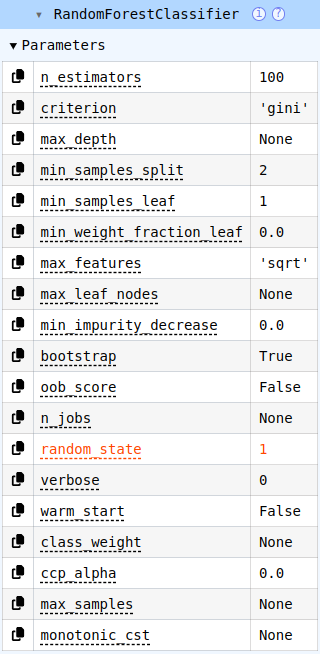
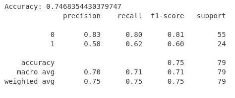

# Random Forest for Classification

## Introduction

Random forest is a popular machine learning method used for classification and regression. Its advantage over logistic regression is that it doesn't require fulfilled assumptions for normal distribution like "no outliers" and it does not assume linearity between the predictors and log-odds of the response, strict independence of errors, or absence of multicollinearity. 

We will be using it here to classify patients as having diabetes or not. I was given this dataset as part of my Introduction to Regression course taken Fall 2025, where we used logistic regression to classify patients as having diabetes or not. 

## Tutorial (aimed at students like me)

"Students like me" means you know basic Python and have taken a regression class. 

### Imports, setup, cleaning...

Starting with imports: Since I'm most familiar with `pandas` (a popular data science package similar to R tidyverse functions), that's what I'll be using for this tutorial. We also need to import the `scikit-learn` package, which is generally considered the most popular data science package. 

```python
import pandas as pd
from sklearn.model_selection import train_test_split
from sklearn.ensemble import RandomForestClassifier
from sklearn.metrics import accuracy_score, classification_report
```

The diabetes dataset is provided at the bottom of this page. The dataset is already pretty tidy, but I decided to drop the `"row"` column as I found it redundant. There isn't any real cleaning to do. 

```python
diabetes = pd.read_csv("/path/to/Diabetes.txt", sep = r"\s+")
diabetes = diabetes.drop(columns = ['row'])
```

At this point, `diabetes` should output this: 


### More setup...

We're going to isolate our response variable and predictor variables to make life easier. (So far, this is just like logistic regression.)

```python
predictors = diabetes.drop(columns=['diabetes'])
response = diabetes['diabetes']
```

Good practice in machine learning is to split up data before training and evaluating a model for later model validation. `scikit-learn` makes this really easy. 

Here, I've chosen the variable names `pred_train`, `pred_test`, `response_train`, and `response_test` for the output of the `train_test_split` function. The function returns what I've described with the variable names: training predictor variables, testing predictor variables, training response variables, and testing response variables.

I've chosen a test size of 0.2 for an 80-20 split, which is pretty standard. `random_state` is the same thing as `set.seed()`; both functions tell your computer where to start its random-but-not-random process. 

```python
pred_train, pred_test, response_train, response_test = train_test_split(predictors, response, test_size=0.2, random_state=1)
```

### Brief Interlude for Explanation 

Random forest is named that way because it builds a bunch of decision trees. One tree is trained on a single bootstrap sample (random, with-replacement sample), meaning it can be thought of as a mini-model that is overfitted and has high variance. 

Each tree splits data into regions based on feature thresholds, and splits at the point that reduces Gini impurity the best. Gini impurity calculates the probability of a randomly chosen element being incorrectly labeled if it was randomly labeled according to the sample used by the tree, with a range from 0 to 0.5, 0 being ideal. 

At each split, the tree only considers a random subset of predictors, which reduces correlation between trees. For the diabetes example, a single tree might say that an individual who has been pregnant 5 times and has a glucose level about 150 is positive for type 2 diabetes, but ignore the patient's BMI. 

Each tree is considered to create the overall model. In the case of classification, a majority vote is used. When we test the model, every tree (in this case, 100) will evaluate the predictor variables and output a 1 or a 0. The majority vote wins, classifying a patient as either having diabetes or not. 

Here's a nice diagram provided by Deniz Gunay via Medium that summarizes the concept well: 


### Fitting the model

Now it's time to fit our model! `n_estimators` refers to the number of trees in the forest, and we've again set `random_state = 1`. Note that we train (fit) the model on the previously allocated 80% of the data. 

```python
random_forest = RandomForestClassifier(n_estimators = 100, random_state = 1)
random_forest.fit(pred_train, response_train)
```

This should output the below image, which summarizes parameters from the model. 



### Making predictions

This will output an array of 1s and 0s, where 1 means YES! THE PATIENT HAS DIABETES! and 0 means NO, THE PATIENT DOES NOT HAVE DIABETES. Note that the predictions are done on the earlier sectioned-out `pred_test` subset of the data, where `pred_test` is 20% of the data. 

```python
predictions = random_forest.predict(pred_test)
predictions
```

### Evaluation

If you set your `random_state = 1`, then the results should look identical to mine. If not, they're probably pretty similar. 



Accuracy is around 75%, which is certainly better than 50%, which is the baseline for deciding whether a classification model is good or not. Interestingly, the model I fit last semester using logistic regression was substantially better with an accuracy of 80.6%.

While this isn't as important, a feature I really like is `feature_importances_`, which tells us how helpful each predictor variable was. 

```python
random_forest.feature_importances_
```
This returns `array([0.086472, 0.26873562, 0.07624572, 0.07654465, 0.13097512, 0.12343495, 0.10309287, 0.13449908])`, which (we need to look at our original data for this) tells us that `glucose` at `0.269` was the most helpful predictor variable, and `diastolic` at `0.0762` was the least helpful predictor variable. 

## Conclusion 

So, it turns out I picked not the greatest dataset to show off random forest with, since logistic regression seems to have done better than random forest. However, we know that random forest is more robust to overfitting (so, it's possible that the random forest model is secretly better), and we can now try this new method on other datasets. It's also important to note that random forest can classify into more than two bins. 

Try out random forest on a dataset you're curious about! Obviously, doing the same analysis I just did would be helpful; you could even try adding more trees or other modifications to see if the results are better.

### As Promised: Diabetes Dataset

[Diabetes.txt](/Diabetes.txt)

---

*This tutorial was created as an assignment for STAT 386.*
